# Magic Hemp

  

> **AVISO IMPORTANTE: ESTE PROJETO E INDICADO PARA MAIORES DE 18 ANOS.**  
> **O tema Magic Hemp, sua identidade visual e sua proposta premium foram pensados para publico adulto.**

  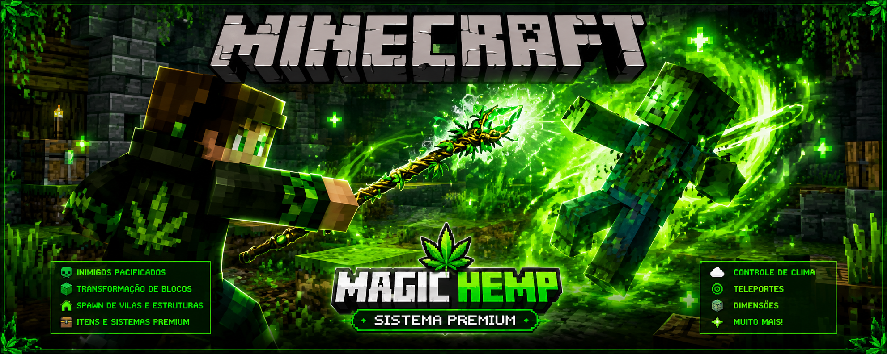

Mod premium para **Minecraft Forge 1.20.1** que transforma a experiencia do Minecraft com varinha magica, menus interativos, transformacao de blocos, spawn de itens, vilas, construcoes, comandos, sistema premium e muito mais.

Com a poderosa **Varinha Magica do Magic Hemp**, o jogador ganha acesso a sistemas especiais capazes de alterar o mundo em tempo real: transformar blocos comuns em recursos raros, controlar criaturas, gerar vilas, spawnar estruturas, acessar menus premium interativos e desbloquear funcoes avancadas diretamente dentro do jogo.

> **MOD FEITO PARA SER USADO JUNTO COM O MAGICHEMP RESOURCE PACK 1.20.1:**  
> **Resource pack oficial:** https://github.com/gorpo/MagicHemp_ResourcePack-Minecraft_1.20.1  
> **O mod entrega a jogabilidade premium: varinha, menus, transformacoes, spawns, vilas, construcoes e comandos. O resource pack entrega a camada visual: texturas, modelos, blocos, itens e atmosfera. Juntos eles formam o pacote premium integrado Magic Hemp, uma experiencia quase completa enquanto o shader oficial ainda esta em desenvolvimento.**

  

**Ordem obrigatoria do resource pack no Minecraft, de cima para baixo:**  
**1. `MagicHemp_1.20.1_Premium526X` -> 2. `MagicHemp_1.20.1_models` -> 3. `MagicHemp_1.20._addon` -> 4. `MagicHemp_1.20.1_bonus`**

---

## MagicHemp Resource Pack

O **MagicHemp Resource Pack** e a metade visual deste projeto. Ele foi feito para ser usado junto com este mod e completa a identidade Magic Hemp com texturas premium, modelos, vegetacao, blocos, itens e acabamento visual para Minecraft 1.20.1.

  

  

**Use os dois juntos:** este mod controla os sistemas e a jogabilidade; o resource pack transforma o visual para fechar o Minecraft premium Magic Hemp.

---

## Sistemas do mod

Explore um sistema magico onde:

- blocos podem evoluir em materiais valiosos
- criaturas hostis podem ser pacificadas
- estruturas podem surgir instantaneamente
- vilas aparecem ao seu redor
- menus premium controlam o mundo inteiro
- comandos especiais desbloqueiam funcoes ocultas
- poderes magicos transformam sua gameplay

---

## Varinha Magica

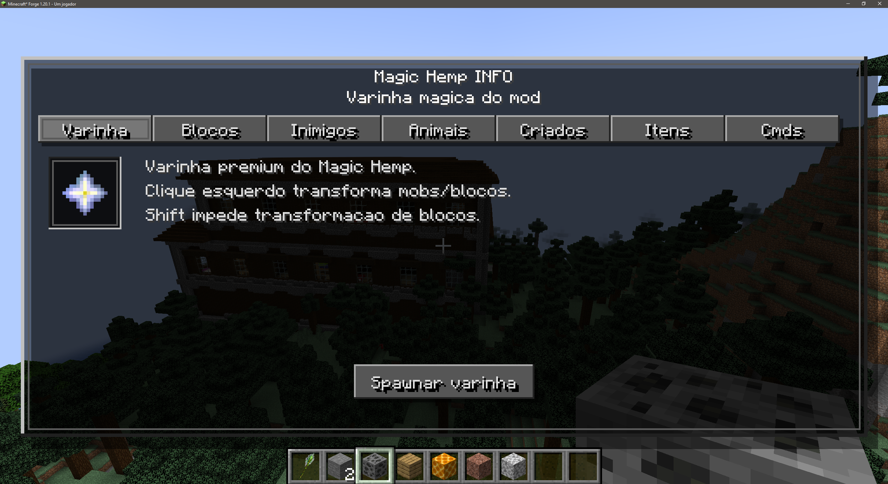

A varinha magica e o item principal do Magic Hemp.  
Ela permite acessar os sistemas do mod, transformar blocos e interagir com criaturas de forma especial.

---

## Blocos

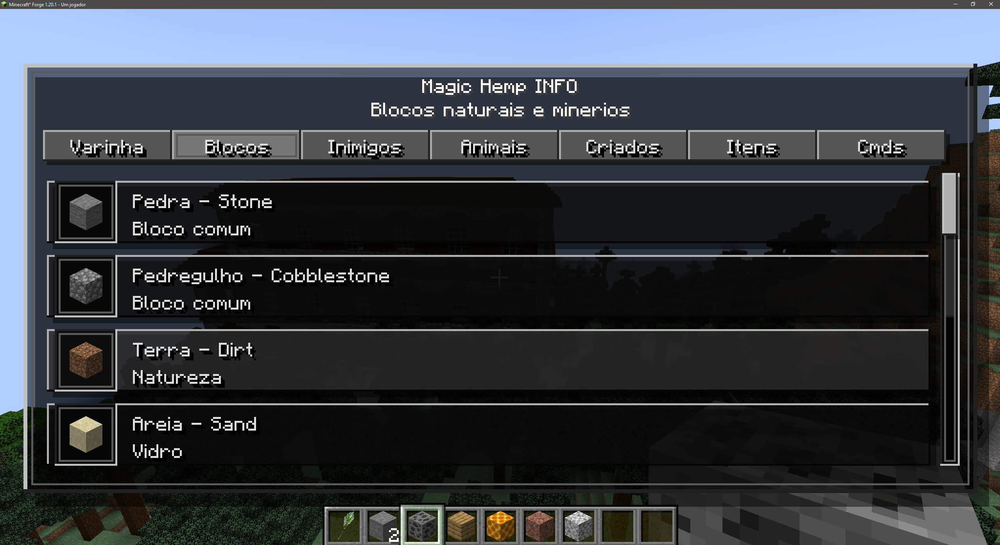

Menu de blocos naturais e minerios.  
Aqui ficam os blocos que podem fazer parte do sistema magico de transformacao e interacao.

---

## Inimigos

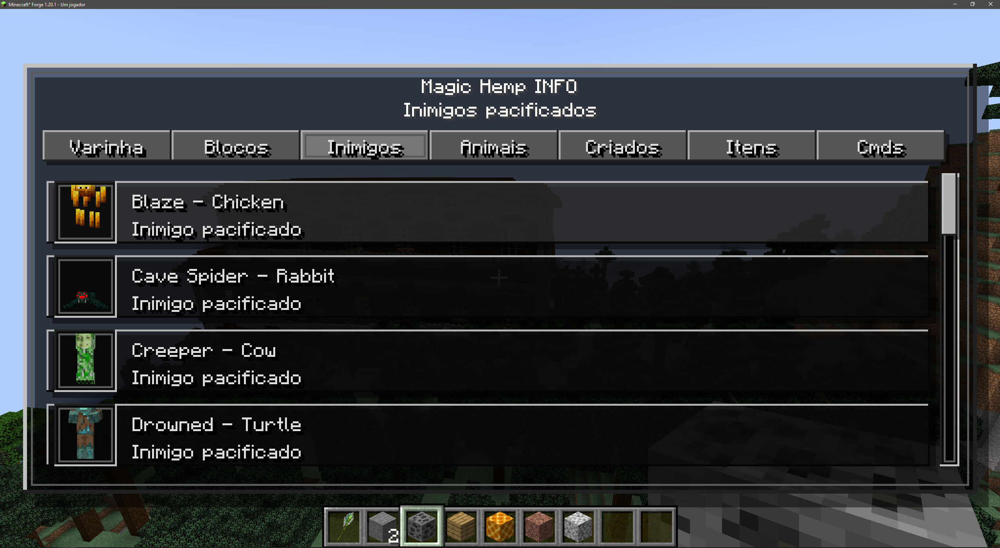

Menu de inimigos pacificados.  
Criaturas hostis podem ganhar comportamento especial dentro do sistema premium do mod.

---

## Animais

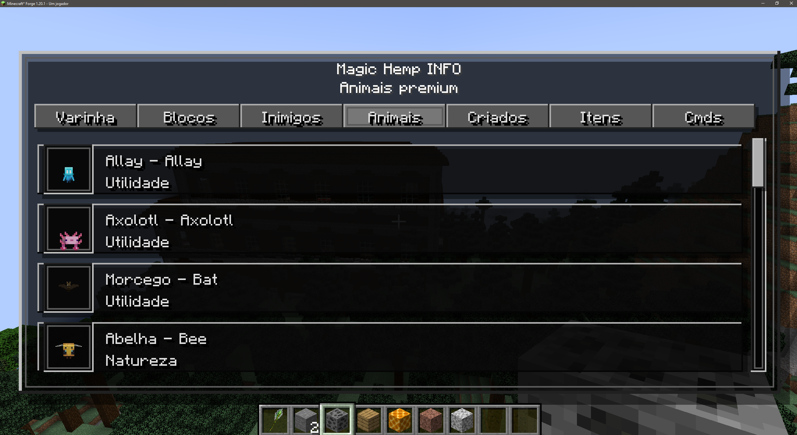

Menu de animais premium.  
Lista criaturas amigaveis e animais que fazem parte dos sistemas magicos do Magic Hemp.

---

## Criados

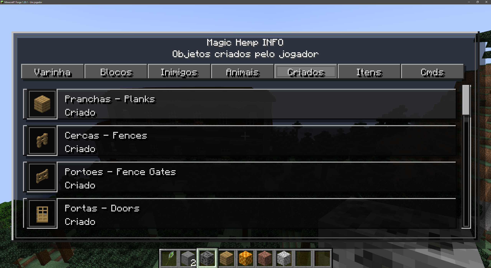

Menu de objetos criados pelo jogador.  
Organiza blocos e itens construidos, como pranchas, cercas, portoes e portas.

---

## Itens

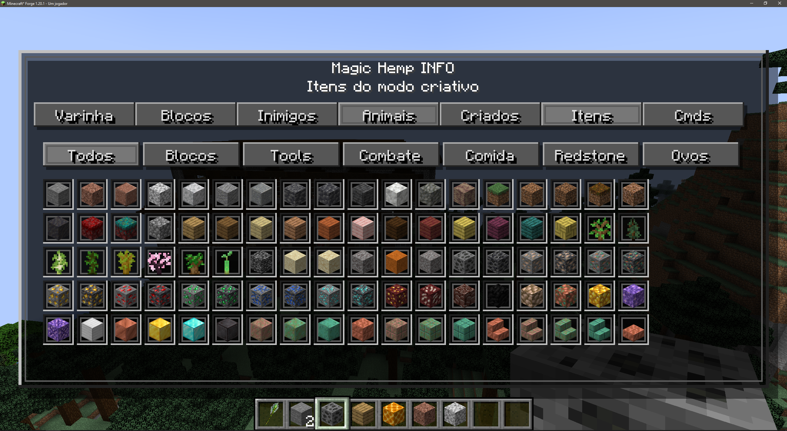

Menu de itens no estilo modo criativo.  
Permite navegar por categorias e acessar diversos itens diretamente pela interface do mod.

---

## Comandos

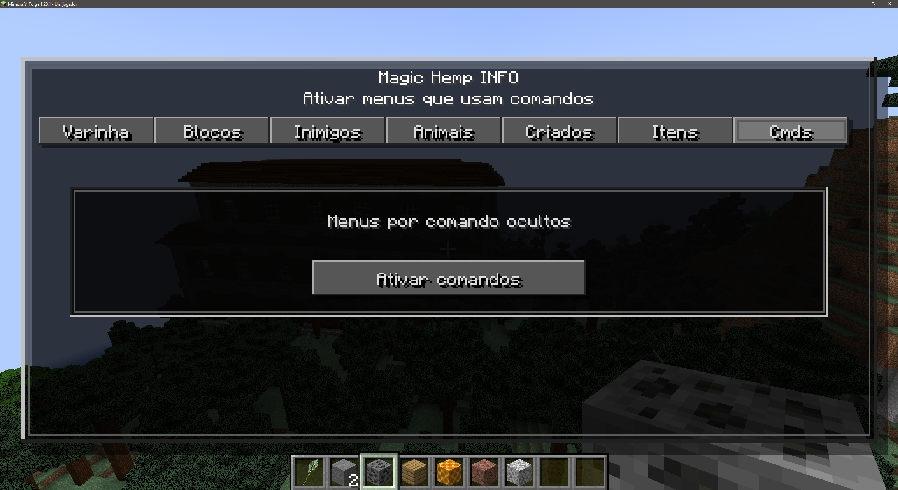

Menu para ativar sistemas que usam comandos.  
Serve para liberar funcoes avancadas e menus especiais dentro do Magic Hemp.

---

## Desativar Comandos

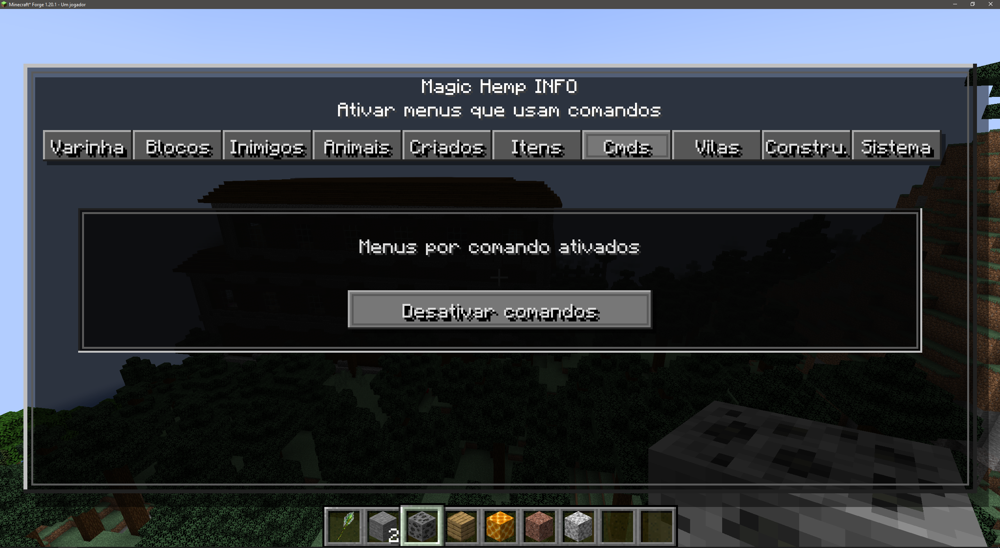

Tela para desativar menus por comando.  
Ajuda no controle das funcoes premium e no gerenciamento dos sistemas ativos.

---

## Vilas

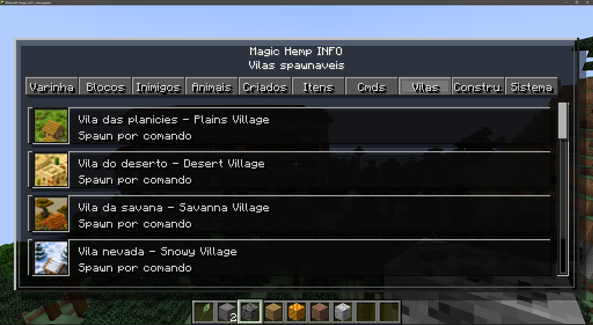

Menu de vilas spawnaveis.  
Permite gerar vilas vanilla como planicie, deserto, savana e neve diretamente pelo menu.

---

## Construcoes

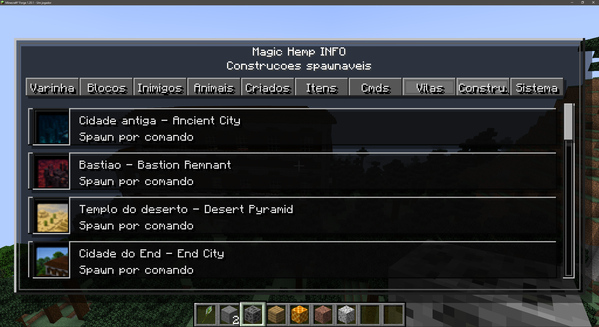

Menu de construcoes spawnaveis.  
Permite gerar estruturas como Ancient City, Bastion, Desert Pyramid e End City.

---

## Sistema

Central premium do mod.  
Reune sistemas avancados como mob spawner, controle de clima, teleporte para biomas e dimensoes.

---

## Tecnologias

- Java
- Minecraft Forge 1.20.1
- Gradle
- IntelliJ IDEA

---

## Magic Hemp

Um mod magico, premium e poderoso para transformar a experiencia do Minecraft.

